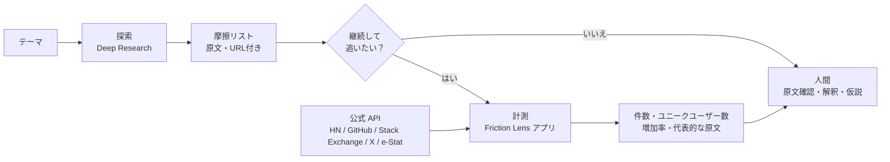

# ADR-0001: 摩擦データの収集方式 — Deep Research で探索し、自作アプリで計測する

| 項目 | 内容 |
|---|---|
| ステータス | 承認 |
| 日付 | 2026-09-29 |
| 決定者 | プロジェクトオーナー |
| 関連資料 | [concept.md](../../concept.md) / [情報源の利用可否調査](../research/2026-09-29-data-source-availability.md) / [情報源の使い方](../customer-friction-research-sources.md) |

---

## 1. 何を決定したのか

**問い：** 顧客の「摩擦の証拠」を、どうやって集めて分析するか。

- 既存ツールを使うか、自分で作るか
- 自分で作る場合、アプリで収集できない情報源をどう補うか

**決定：** 役割を 2 つに分け、両方を使う。

- **探索**：AI の Deep Research で、幅広い情報源から摩擦を定性的に洗い出す
- **計測**：自作アプリ（Friction Lens）で、公式 API から集めたデータの件数・増加率・原文を定点観測する

---

## 2. 結論

### 2.1 役割分担

| | 探索（Deep Research） | 計測（Friction Lens アプリ） |
|---|---|---|
| 目的 | どのテーマ・摩擦を掘るか、当たりをつける | 選んだテーマの摩擦を数え、変化を追う |
| 情報源 | Reddit、アプリレビュー、G2、知恵袋など、アプリで収集できないものを含む全般 | 公式 API で自動収集できるもの（2.2） |
| 出力 | 摩擦のリスト（原文の引用と URL 付き） | 件数、ユニークユーザー数、増加率、代表的な原文 |
| 使う場面 | 新しいテーマを調べ始めるとき | 継続して追うと決めたテーマ |



### 2.2 アプリに組み込む情報源

**規則：** 個人利用で「自動収集 ◎／○」と判定した情報源だけを、公式 API で組み込む（判定の詳細は[調査結果](../research/2026-09-29-data-source-availability.md)を参照）。

| 区分 | 情報源 | 分野（言語） | 取り込み方 |
|---|---|---|---|
| **組み込む（投稿）** | Hacker News | 技術者・スタートアップ（英語） | 公式 API |
| | GitHub Issues | 開発ツール・OSS の利用者（英語中心） | 公式 API |
| | Stack Exchange | 技術 Q&A が中心。家計・DIY・職場など、生活や仕事のコミュニティもある（英語） | 公式 API |
| | X | 全分野の一般の声（日本語を含む） | 公式 API（有料） |
| **組み込む（統計）** | e-Stat | 全業界の公的統計（人口・企業数など。市場規模の把握に使う） | 公式 API |
| **手動で取り込む** | Google Trends | 全分野の検索需要（国・地域別） | CSV を手動で登録 |
| | PIO-NET 公開統計 | 消費者トラブル（通販・契約・金融・通信など） | 数値を手動で登録 |
| | CW AI Letter／ランサーズ発注トレンド | 日本の外注市場（Web 制作・動画・デザインなど） | 数値を手動で登録 |
| **組み込まない** | Reddit | 全分野の生活・仕事・趣味（英語） | Deep Research・手動閲覧 |
| | App Store／Google Play | 一般消費者向けアプリ（B2C、国別・多言語） | Deep Research・手動閲覧 |
| | G2／Capterra | 企業向けソフトウェア（B2B SaaS、英語中心） | Deep Research・手動閲覧 |
| | Yahoo!知恵袋 | 日本の生活全般の悩み（日本語） | Deep Research・手動閲覧 |
| | ランサーズ／クラウドワークス | 日本の業務の外注（日本語） | Deep Research・手動閲覧 |

> **分野の偏り：** 自動で数えられる投稿は開発者・技術系が中心で、一般消費者や日本語の声は X だけになる。対策は 7 章を参照。

### 2.3 既存ツールの扱い

- 主な手段としては採用しない（理由は 5 章の選択肢 A）。
- 自作アプリの出力と比べる目的で試用するのは構わない。

---

## 3. 背景

- **目的：** concept.md の核は、摩擦の「件数・強さ・回避策・支払意思」を集計し、人間が原文を確認できることにある。AI にアイデアを決めさせない。
- **前提：** 自分専用のツールで、商用提供はしない。開発時間はなるべく抑えたい。
- **2026-09-29 の調査でわかったこと：**

| 調査 | 結果 |
|---|---|
| 既存ツール | 約 80 製品を調べた。回避策の抽出・ユニークユーザー数・GitHub Issues・日本語の情報源をすべて満たす製品はなかった。近い製品も、Reddit 限定、アイデア生成寄り、データ取得方法が非公開のいずれか |
| 情報源 | 個人利用でも、Reddit・アプリストア・G2・知恵袋・ランサーズは自動収集できない |
| Deep Research | 1 回に読めるのは数十〜数百件。実行するたびに結果が変わる。引用の正確さは 40〜80% という評価がある |

---

## 4. 判断基準

| 基準 | 重み | 理由 |
|---|---|---|
| 計測できる（件数・ユニークユーザー数・増加率・再現性） | 高 | concept.md の核だから |
| 原文で確認できる | 高 | 基本思想「AI に判断させすぎない」 |
| 規約を守れる | 高 | 個人利用でも規約違反は避ける |
| 情報源の幅 | 中 | 開発者以外や日本語の声も拾いたい |
| 開発時間 | 中 | 自分で開発に使える時間は限られる |
| 費用 | 低〜中 | 個人で払える範囲に収める |

---

## 5. 検討した選択肢

| 選択肢 | 計測 | 原文確認 | 規約 | 情報源の幅 | 開発時間 | 費用 | 判定 |
|---|---|---|---|---|---|---|---|
| A. 既存ツールを使う | △ | △ | ？ | △ | ◎ | △ | 不採用 |
| B. Deep Research だけ | ✕ | △ | ○ | ◎ | ◎ | ○ | 不採用 |
| C. 自作アプリだけ | ◎ | ◎ | ◎ | ✕ | △ | ○ | 不採用 |
| **D. B と C の併用** | **◎** | **○** | **◎** | **○** | **△** | **○** | **採用** |
| E. スクレイピングで全情報源を自作アプリに入れる | ◎ | ◎ | ✕ | ◎ | ✕ | △ | 不採用 |

### A. 既存ツールを使う（開発しない）

- **良い点：** 開発が不要で、すぐに使える。
- **不採用の理由：**
  - 条件を満たす製品がない。
    - 最も近い EchoSift（GitHub・HN に対応）は、営業チーム向けに方針転換したとみられる。
    - PainOnSocial・Reddinbox は Reddit 限定。
    - PainHunt はアイデア検証寄り。
  - 回避策の抽出、ユニークユーザー数、日本語の情報源は、どの製品にもない。
  - 多くの製品はデータの取得方法を公開していない。GummySearch（ユーザー 13.5 万人）は Reddit と契約できずに閉鎖しており、同じように突然止まるリスクがある。
  - 情報源ごとに複数の製品を契約する必要があり、月 $19〜$199 の費用が積み重なる。

### B. Deep Research だけ

- **良い点：** 開発が不要。アプリで収集できない情報源にも届く。
- **不採用の理由：**
  - 件数・ユニークユーザー数・増加率を出せない。読むのは数十〜数百件で、毎回ゼロから検索するため。
  - 再現性がないので、前回との比較ができない。
  - 引用の正確さは 40〜80% で、出力は AI による要約（＝判断）になる。基本思想の「AI に判断させすぎない」に反する。

### C. 自作アプリだけ

- **良い点：** 計測・原文確認・規約の遵守をすべて満たす。
- **不採用の理由：** 使える情報源が開発者向け・英語中心に偏る。一般消費者や日本語の声は、X 以外ではほとんど拾えない。

### E. スクレイピングで全情報源を自作アプリに入れる

- **良い点：** 情報源の幅と計測を両立できる。
- **不採用の理由：** 個人利用でも規約違反になる。サイトごとの対応や遮断への対策が必要で、開発・保守の負担も大きい。

---

## 6. 決定した理由

1. **計測はアプリにしかできない。** concept.md の核（件数・ユニークユーザー数・増加率・原文）は、Deep Research では構造的に出せない。
2. **情報源の幅は Deep Research にしか出せない。** 規約上、アプリで自動収集できない情報源が多い。
3. **弱点を補い合える。** Deep Research は数えられず、アプリは広く読めない。
4. **規約を守れる。** アプリは公式 API だけを使い、それ以外は Deep Research と手動閲覧に任せる。
5. **開発時間を抑えられる。** 探索を Deep Research に任せるので、アプリは計測に絞った小さな MVP から始められる。

---

## 7. 影響とトレードオフ

**良い影響**

- 探索は今日から始められる。開発の完了を待つ必要がない。
- アプリの範囲が「計測」に絞られ、MVP が小さくなる。
- 規約違反のリスクがない。

**悪い影響・リスクと対策**

| リスク | 対策 |
|---|---|
| アプリで数えられるのは、開発者向け・英語の声が中心 | 一般向け・日本語のテーマは X（有料）で補う。数えられない部分は、Deep Research の定性的な結果として扱う |
| Payment Signal の主な情報源（ランサーズ・クラウドワークス）を自動収集できない | 投稿本文から支払いの表現（「外注した」「月 $X 払っている」）を抽出する。公式の集計レポートは手動で参照する |
| Deep Research の引用に誤りが混じる | URL を抜き取りで開き、その発言が実在するか確認する |
| Deep Research とアプリで出力の形式がそろわない | Deep Research にも Friction Event の項目で出力させる（8.1） |
| GitHub Issues のノイズが多い（1 週間で約 4.7 万件、うち約 4 割が Bot） | MVP の段階から、Bot の除外、対象リポジトリの選定、👍・コメント数での足切りを入れる |
| X と LLM（抽出・埋め込み）の費用がかさむ | 月の予算上限を設ける。キーワードで事前に絞り込んでから LLM に渡す |

---

## 8. 運用ルール

### 8.1 Deep Research の使い方

- Reddit を含めたい場合は、Reddit とデータ契約を結んでいる Google（Gemini）か OpenAI（ChatGPT）の Deep Research を優先する。
- プロンプトで Friction Event の項目を指定し、件数の推測とアイデアの提案を禁止する。

```text
テーマ「○○」について、Reddit・レビュー・Q&Aサイトから困りごとを集めてください。
各項目に「誰が / どんな状況で / 何に困っているか / 今どう回避しているか
（Excel・手作業・自作スクリプト・外注など）/ お金を払っている兆候」と、
原文の引用・URLを付けてください。
件数や割合の推測は書かないでください。解決策やビジネスアイデアの提案は不要です。
```

- 出力された URL を 3〜5 件開き、その発言が実在するか確認する。

### 8.2 テーマをアプリに登録する基準

次のいずれかに当てはまれば、アプリで計測する。

- 継続して追いたい（増えているか、減っているかを知りたい）
- 件数やユニークユーザー数で規模を確かめたい
- HN・GitHub・Stack Exchange・X に声がありそう

### 8.3 アプリの開発順序

| フェーズ | 範囲 | concept.md との対応 |
|---|---|---|
| MVP | HN と GitHub Issues。摩擦の抽出 → グループ化 → 件数・ユニークユーザー数 → 代表的な原文 | Phase 1〜3 |
| 次 | Stack Exchange と X（予算上限つき）を追加。7/30/90 日の増加率 | Phase 4 |
| その後 | e-Stat、Google Trends（CSV）、PIO-NET 統計を文脈データとして追加 | Phase 5〜6 の一部 |

---

## 9. 再検討する条件

| 条件 | 見直す内容 |
|---|---|
| Reddit の API 利用が承認された | Reddit をアプリに追加するか |
| Google Trends の公式 API（アルファ版）が承認された | 手動の CSV から自動取得に切り替えるか |
| 条件を満たす既存ツールが現れた | 選択肢 A をもう一度評価する |
| Deep Research が件数集計や定点観測に対応した | 役割分担を見直す |
| 商用化を検討することになった | 情報源の判定をすべてやり直す（調査結果の「参考: 商用」列を参照） |

---

## 10. 次のアクション

1. Deep Research で 2〜3 テーマを試し、8.1 のプロンプトと確認手順が実際に回るか確かめる。
2. HN と GitHub Issues の MVP を設計・実装する。
3. concept.md の情報源一覧と Phase 5（支払意思分析）を、この ADR に合わせて更新する。

---

## 11. まとめ

- **決定：** Deep Research で探索し、自作アプリで計測する。両方を使う。
- **理由：** 計測はアプリにしかできず、情報源の幅は Deep Research にしか出せない。
- **アプリの範囲：** 公式 API で自動収集できる情報源（HN・GitHub・Stack Exchange・X・e-Stat）だけを組み込む。
- **次の一歩：** Deep Research で数テーマを試しながら、HN と GitHub Issues の MVP を作る。

---

## 参考

- 情報源の利用可否: [docs/research/2026-09-29-data-source-availability.md](../research/2026-09-29-data-source-availability.md)
- Deep Research の引用精度: DeepTRACE — https://arxiv.org/abs/2509.04499
- Deep Research の網羅性の弱さ: Deep Research Bench — https://arxiv.org/abs/2506.06287
- GummySearch の閉鎖: https://gummysearch.com/final-chapter/
- EchoSift: https://echosift.io/
- PainOnSocial: https://painonsocial.com/
- Reddinbox: https://reddinbox.com/
- PainHunt: https://painhunt.dev/
