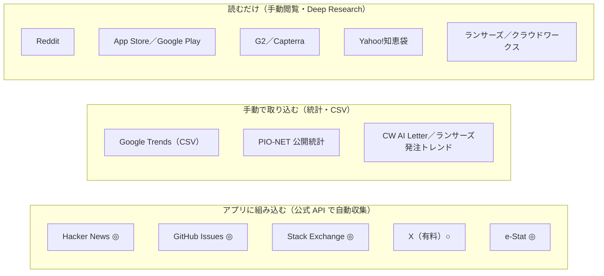

# 情報源の利用可否調査（個人利用）

| 項目 | 内容 |
|---|---|
| 調査日 | 2026-09-29 |
| 前提 | Friction Lens は**自分専用のツール**として使う。商用提供はしない |
| 目的 | 各情報源のデータを、個人利用の範囲でアプリに取り込めるかを判定する |
| 確認したもの | 公式 API ドキュメント、利用規約の条文、robots.txt（いずれも 2026-09-29 に取得） |
| 注意 | 規約を読んだ時点での判断であり、法的助言ではない。二次情報に基づく箇所はその旨を明記した |

関連資料: [concept.md](../../concept.md) / [情報源の使い方](../customer-friction-research-sources.md) / [ADR-0001](../adr/0001-deep-research-and-api-app.md)

---

## 1. 結論

- 個人利用で**公式 API による自動収集ができる**のは、Hacker News・GitHub Issues・Stack Exchange・X（有料）・e-Stat。
- Reddit・App Store・Google Play・G2／Capterra・Yahoo!知恵袋・ランサーズは、**個人・非商用でも自動収集できない**。規約で禁止されているか、API が事実上閉じている。どの規約にも「個人利用なら可」という例外はない。
- 個人利用なら、著作権（私的複製・情報解析）と個人情報保護法は問題になりにくい。**制約になるのは各サービスの規約（契約）**。
- concept.md の MVP（HN と GitHub Issues）は、規約上問題なく実装できる。

---

## 2. 判定一覧

凡例: ◎ 問題なし / ○ 条件付きで可 / △ グレー（推奨しない） / ✕ 規約上不可 / — 該当なし

| 情報源 | 種類 | 自動収集（個人） | 手で読む | アクセス方法 | 費用 | 参考: 商用 |
|---|---|---|---|---|---|---|
| Hacker News | 投稿 | ◎ | ◎ | 公式 Firebase API／Algolia 検索 API | 無料 | ○〜△ |
| GitHub Issues | 投稿 | ◎ | ◎ | REST／Search API | 無料 | ○ |
| Stack Exchange | 投稿 | ◎ | ◎ | 公式 API | 無料 | ○〜△ |
| X | 投稿 | ○ | ◎ | 公式 API（従量課金） | $0.005/件 | ○ |
| e-Stat | 統計 | ◎ | ◎ | 公式 API | 無料 | ◎ |
| PIO-NET | 統計 | —（生データ非公開） | ◎ | 公開統計を手動で取得 | 無料 | ◎ |
| Google Trends | 検索需要 | △ | ◎ | 画面から CSV をダウンロード | 無料 | △ |
| クラウドワークス | 外注案件 | △ | ◎ | 手で閲覧／公式の集計レポート | 無料 | ✕ |
| ランサーズ | 外注案件 | ✕ | △ | 手で閲覧／公式の集計レポート | 無料 | ✕ |
| Yahoo!知恵袋 | 投稿 | ✕ | △ | 手で閲覧 | 無料 | ✕ |
| Reddit | 投稿 | ✕（事実上） | ◎ | 手で閲覧 | — | ✕ |
| App Store | レビュー | ✕ | ◎ | 手で閲覧 | — | △ |
| Google Play | レビュー | ✕ | ◎ | 手で閲覧 | — | ✕〜△ |
| G2／Capterra | レビュー | ✕ | △ | 手で閲覧 | — | 契約時のみ |

> 「手で読む」が △ のもの：閲覧は問題ないが、本文をコピーして保存するのは規約の文言上グレー。**URL と自分の言葉で書いた要約だけを記録する。** 予算額や件数などの事実データには著作権がない。

---

## 3. 情報源ごとの詳細

### 3.1 Hacker News — 自動収集 ◎

| 観点 | 内容 |
|---|---|
| API | 公式 Firebase API（`hacker-news.firebaseio.com/v0/`）：認証不要。README には「There is currently no rate limit.」とある |
| | Algolia HN Search API（`hn.algolia.com/api/v1/search`）：全文検索ができ、1 IP あたり 10,000 リクエスト/時（二次情報） |
| 規約 | YC のサイト規約は「data mining, robots, scraping or similar data gathering or extraction methods」を禁止している → **Web ページの直接取得は ✕**。公式 API は YC 自身が開発者向けに公開しているもの |
| robots.txt | `Crawl-delay: 30` |
| 実装メモ | Algolia は 1 クエリで最大 1,000 件まで → `created_at_i` で期間を分割して取得する |

### 3.2 GitHub Issues — 自動収集 ◎

| 観点 | 内容 |
|---|---|
| API | REST：認証ありで 5,000 回/時。Search：30 回/分、1 検索あたり最大 1,000 件 |
| 規約 | 利用ポリシー §7 に「Scraping does not refer to the collection of information through our API」とある（API での収集はスクレイピングに当たらない）。禁止されているのは、スパム目的・個人情報の販売・過剰な自動一括処理 |
| 実装メモ | 「code review」で 1 週間分を検索すると 47,069 件。先頭 100 件のうち 43 件が Bot で、残りも大半が作業チケットだった → Bot の除外、対象リポジトリの選定、👍・コメント数での足切りが必須 |

### 3.3 Stack Exchange — 自動収集 ◎

| 観点 | 内容 |
|---|---|
| API | キーあたり 10,000 回/日。1 IP から 30 回/秒を超えると遮断される。応答の `backoff` の指示に従う |
| 規約 | 投稿（Subscriber Content）は CC BY-SA 4.0。API 経由の取得は許可されている。それ以外の方法での取得も「personal, noncommercial use」なら可（Public Network Terms, 2025-11-13）。API 規約で、出典（Stack Exchange）の表示が必須 |
| 注意 | 利用ポリシーは「生成 AI・LLM の開発・学習・評価」を目的とする自動収集を禁止している。自分用の分析に LLM を使うのはモデル開発ではないが、解釈の余地は残る |

### 3.4 X — 自動収集 ○（有料）

| 観点 | 内容 |
|---|---|
| API | 従量課金。投稿の読み取りは $0.005/件（1 万件で約 $50）、ユーザー情報の読み取りは $0.010/件 |
| 規約 | Developer Agreement（2026-04-27）：従量課金などのプランは「hobbyists, commercial prototyping, initial development」向けと明記。削除・非公開化された投稿は、依頼から 24 時間以内に手元でも削除する義務がある。基盤モデルの学習への利用は禁止 |
| 条件 | 月の予算上限を設定する。削除を反映する仕組み（定期的な再確認、または保存期間を短くする）を用意する |

### 3.5 e-Stat — 自動収集 ◎

| 観点 | 内容 |
|---|---|
| API | 無料。アプリケーション ID の登録が必要。1 回で最大 10 万件。短時間の大量アクセスは禁止 |
| 規約 | 商用利用も可（CC BY 4.0 互換）。出典の表示が必要で、加工した場合はその旨も明記する |

### 3.6 PIO-NET（国民生活センター） — 統計のみ ◎

- 生データは非公開（接続できるのは全国の消費生活センターと中央省庁のみ）。
- 公開統計：「各種相談の件数や傾向」（26 分野、直近 3 年度、2026-07-31 更新）と、年度別の相談件数（2025 年度は 1,006,377 件）。

### 3.7 Google Trends — 自動 △／手動 ◎

| 方法 | 判定 | 内容 |
|---|---|---|
| 画面から CSV をダウンロード | ◎ | 標準の機能 |
| 公式 Trends API | ○（承認されれば） | 2025 年 7 月に発表されたアルファ版で、申請制。直近 5 年分を取得でき、リクエストをまたいで値を比較できる |
| pytrends | ✕ | 開発終了（アーカイブ済み） |
| SerpApi など | △ | 有料。Google と Reddit から提訴されており、ベンダーとしてのリスクがある |

規約：Google 利用規約（2026-07-30）は、robots.txt に反する自動アクセスを禁止している。

### 3.8 クラウドワークス — 自動 △

| 観点 | 内容 |
|---|---|
| API | 公開 API は確認できず |
| 規約 | 利用規約（2026-07-14 改定）第 2 条：「利用者」には閲覧者も含まれる。第 23 条：無権限アクセス、運営の妨害、書面承認のない営業活動を禁止。**閲覧情報の収集を名指しで禁じる条項は見当たらない** |
| robots.txt | 一般のクローラーには案件ページを許可。`/api/` は Disallow。GPTBot・ClaudeBot・meta-externalagent は全面拒否（AI での利用を嫌う意思表示） |
| 判定 | 明示的な禁止はないが、グレーなのでアプリには組み込まない。公式の月次レポート「CW AI Letter」の集計値を使う |

### 3.9 ランサーズ — 自動 ✕

| 観点 | 内容 |
|---|---|
| 規約 | 利用規約（2026-09-28 施行）第 1 条：「ユーザ」には閲覧者も含まれる |
| | 第 31 条 1 項 15 号：「…いかなる手法であるかにかかわらず、商業・営業目的の活動、営利を目的とした利用及びその準備を目的とした利用をすること、その他本サイトの二次利用や複製行為」を禁止 |
| | 同 16 号：高負荷アクセスを禁止 |
| 私的利用の例外 | なし |
| 代替 | 公式の「発注トレンドランキング」「フリーランス実態調査」 |

### 3.10 Yahoo!知恵袋 — 自動 ✕

| 観点 | 内容 |
|---|---|
| API | 知恵袋 API は 2017-04-26 に終了。全量データは NTT データが独占販売している（2017 年の発表。現在の状況は未確認） |
| 規約 | LINEヤフー共通利用規約（2025-02-03 改定）：ログイン不要のサービスは、利用した時点で規約に同意したものとみなされる（2.2） |
| | 8.3：「本コンテンツを、当社サービスが予定している利用態様を超えて利用（複製、送信、転載、改変を含みます。）をしてはなりません」 |
| | 第 14 条：サービスとそのデータを「提供目的を超えて利用することができません」 |
| | 知恵袋の利用ルール：商業目的・広告目的の利用を禁止 |
| robots.txt | `chiebukuro.yahoo.co.jp`：`/search`・`/api`・`/detail/q*` を Disallow |
| | `detail.chiebukuro.yahoo.co.jp`：一般のクローラーには質問ページを許可しているが、AI 系（GPTBot・ClaudeBot・CCBot など）は全面拒否 |
| 私的利用の例外 | なし |

### 3.11 Reddit — 自動 ✕（事実上）

| 観点 | 内容 |
|---|---|
| API | 2025-11-11 施行の Responsible Builder Policy により、**個人の趣味開発を含むすべての API 利用が事前承認制**になった。個人用途は却下・放置の報告が多い（二次情報）。既に発行済みの認証情報は引き続き使える |
| その他の経路 | ログインなしで取得できた `.json` は、2026 年 5 月末から 403 を返す。robots.txt もスクリプトからのアクセスに開発者登録を求めている |
| 規約 | Data API Terms：商用・研究などの目的は別途契約が必要（redditinc.com を取得できなかったため二次情報） |
| 背景 | Google（2024-02）・OpenAI とデータライセンス契約を結んでいる。Anthropic（2025-06）、Perplexity・SerpApi など（2025-10）を提訴。GummySearch は Reddit と契約に至らず閉鎖した（2025-11-30 に新規受付を停止） |

### 3.12 App Store — 自動 ✕

| 観点 | 内容 |
|---|---|
| 経路 | レビューの RSS（`itunes.apple.com/{国}/rss/customerreviews/id={ID}/...`）は 2026-09-29 時点で動作している。ただし robots.txt が `/*/rss/*` を Disallow |
| 規約 | Apple Website Terms：「'deep-link', 'page-scrape', 'robot', 'spider' or other automatic device…」による取得を禁止。個人・非商用で情報を得る目的の閲覧は可 |
| 公式 API | App Store Connect API は自社アプリのみ |

### 3.13 Google Play — 自動 ✕

| 観点 | 内容 |
|---|---|
| 経路 | 非公式ライブラリ（google-play-scraper）は `/_/PlayStoreUi/data/batchexecute` にアクセスする。robots.txt はこの `/_` を Disallow |
| 規約 | Google 利用規約は、robots.txt に反する自動アクセスを禁止 |
| 公式 API | Play Developer API は自社アプリの直近 1 週間分のみ |

### 3.14 G2／Capterra — 自動 ✕

| 観点 | 内容 |
|---|---|
| 規約 | G2 利用規約（2026-07-09）：「access, collect, copy, scrape, harvest, cache, index, store, archive」を禁止。ログイン不要の公開ページにも適用される。取得したデータを機械学習に使うことも禁止。個人利用の例外はない |
| Capterra | 2026-02 に G2 が買収。規約（2026-05-04 改定）も G2 とほぼ同じ（今回は本文を取得できず、前回の調査に基づく） |
| API | パートナー契約が前提 |

---

## 4. 横断的な論点

### 4.1 「個人利用」でも事業目的と見なされる可能性

Friction Lens の用途（事業の種を探す）は、規約によっては「事業目的の準備」と解釈される余地がある。

| 情報源 | 規約上の扱い | 判定への影響 |
|---|---|---|
| ランサーズ | 「営利を目的とした利用…その準備」も禁止 | もともと ✕ |
| Reddit | 市場調査は商用扱いとの報告がある | もともと ✕ |
| X | 従量課金プランは「commercial prototyping」も対象 | 影響なし |
| Stack Exchange | 投稿は CC BY-SA で、用途を問わない | 影響なし |
| HN／GitHub | 個人と商用の区別なし | 影響なし |

→ **どの情報源も判定は変わらない。**

### 4.2 日本の法律

| 論点 | 個人利用（本プロジェクト） | 参考: 商用にする場合 |
|---|---|---|
| 著作権 | 私的使用のための複製（30 条）と情報解析（30 条の 4）で説明でき、問題になりにくい | 抜粋の表示は 47 条の 5（軽微利用）の範囲に限られる。データを販売しているサービスをスクレイピングで代替すると、30 条の 4 ただし書に当たるリスクがある |
| 規約（契約） | **著作権法上は問題なくても、規約違反の責任は免れない** | 同左 |
| 個人情報保護法 | 事業に使わない私的利用なら、義務の対象外 | ユーザー名付きの投稿を顧客に見せると、第三者提供に当たる可能性がある |

---

## 5. コンセプトへの影響

| concept.md の要素 | 当初想定していた情報源 | 利用可否 | 代替 |
|---|---|---|---|
| MVP（摩擦の抽出・集計） | GitHub Issues、HN | ◎ | そのまま |
| 幅広い生の声 | Reddit、知恵袋 | ✕ | Deep Research・手動閲覧。日本語の声は X（有料） |
| 既存製品への不満 | App Store、Google Play、G2、Capterra | ✕ | Deep Research・手動閲覧 |
| Payment Signal | ランサーズ、クラウドワークス | ✕／△ | 投稿本文の支払い表現（「外注した」「月 $X 払っている」）と、公式の集計レポート |
| 需要の変化 | Google Trends | 手動 ◎ | CSV を手動で取り込む。公式 API が承認されれば自動化 |
| 深刻度・市場規模 | PIO-NET、e-Stat | ◎ | そのまま |

---

## 6. アプリ実装時のルール

1. 公式 API だけを使う。Web ページの直接取得（スクレイピング）はしない。
2. レート制限を守る（GitHub Search は 30 回/分、Stack Exchange は 10,000 回/日で `backoff` にも従う、など）。
3. X は月の予算上限を設定し、削除された投稿を定期的に反映する。
4. 投稿者名はハッシュ化して保存し、ユニークユーザー数の計算にだけ使う。
5. Stack Exchange と e-Stat のデータは、出典を記録・表示する。
6. 手で読む情報源（知恵袋・ランサーズ・G2 など）は、URL と自分の要約だけを記録し、本文はコピーしない。

---

## 7. 未確認事項

- Algolia HN Search API の利用規約とレート制限（ページの内容を取得できなかった）
- Reddit Data API Terms の最新の条文と改定日（redditinc.com を取得できなかった）
- NTT データによる知恵袋データ販売の現状
- Capterra 利用規約の本文（今回は取得できなかった）
- HN の BigQuery 公開データセットの、2026 年時点での更新状況

---

## 8. 出典

**API・規約（一次情報）**
- Hacker News API: https://github.com/HackerNews/API
- HN Search API（Algolia）: https://hn.algolia.com/api
- Y Combinator Legal: https://www.ycombinator.com/legal/
- GitHub Acceptable Use Policies: https://docs.github.com/en/site-policy/acceptable-use-policies/github-acceptable-use-policies
- GitHub REST API rate limits: https://docs.github.com/en/rest/using-the-rest-api/rate-limits-for-the-rest-api
- GitHub Search API: https://docs.github.com/en/rest/search/search
- Stack Overflow Public Network Terms: https://stackoverflow.com/legal/terms-of-service/public
- Stack Exchange API Throttles: https://api.stackexchange.com/docs/throttle
- Stack Overflow API Terms of Use: https://stackoverflow.com/legal/api-terms-of-use
- Stack Overflow Acceptable Use Policy: https://stackoverflow.com/legal/acceptable-use-policy
- X API Pricing: https://docs.x.com/x-api/getting-started/pricing
- X Developer Agreement: https://docs.x.com/developer-terms/agreement
- e-Stat API 利用規約: https://www.e-stat.go.jp/api/terms-of-use
- e-Stat 利用規約: https://www.e-stat.go.jp/terms-of-use
- PIO-NET: https://www.kokusen.go.jp/pionet/
- 各種相談の件数や傾向: https://www.kokusen.go.jp/soudan_topics/
- Google Trends API: https://developers.google.com/search/apis/trends
- Google 利用規約: https://policies.google.com/terms
- クラウドワークス利用規約: https://crowdworks.jp/pages/agreement
- ランサーズ利用規約: https://www.lancers.jp/help/terms
- LINEヤフー共通利用規約: https://www.lycorp.co.jp/ja/company/terms/
- Yahoo!知恵袋 利用ルール: https://chiebukuro.yahoo.co.jp/topic/guide/rule/
- 知恵袋 API 終了のお知らせ: https://developer.yahoo.co.jp/changelog/2017-02-23-chiebukuro01.html
- NTT データ（知恵袋データの販売提携）: https://www.nttdata.com/jp/ja/news/release/2017/032800/
- Reddit Responsible Builder Policy: https://support.reddithelp.com/hc/en-us/articles/42728983564564-Responsible-Builder-Policy
- Apple Website Terms of Use: https://www.apple.com/legal/internet-services/terms/site.html
- App Store Connect API（Customer Reviews）: https://developer.apple.com/documentation/appstoreconnectapi/customer-reviews
- Google Play Developer API（Reply to Reviews）: https://developers.google.com/android-publisher/reply-to-reviews
- G2 Terms of Use: https://legal.g2.com/terms-of-use
- Capterra Terms of Use: https://www.capterra.com/legal/terms-of-use/
- 文化庁「AI と著作権に関する考え方について」: https://www.bunka.go.jp/seisaku/chosakuken/aiandcopyright.html

**robots.txt（2026-09-29 に直接取得）**
- itunes.apple.com、play.google.com、crowdworks.jp、www.lancers.jp、chiebukuro.yahoo.co.jp、detail.chiebukuro.yahoo.co.jp、news.ycombinator.com、www.reddit.com

**二次情報**
- ReplyDaddy（Reddit の事前承認制）: https://replydaddy.com/blog/reddit-api-pre-approval-2025-personal-projects-crackdown
- FetchLayer（Reddit API 2026）: https://fetchlayer.dev/blog/reddit-api-closed-2026
- redditapis.com（Reddit Data API 2026）: https://www.redditapis.com/blogs/reddit-data-api-2026
- GummySearch 閉鎖の告知: https://gummysearch.com/final-chapter/
