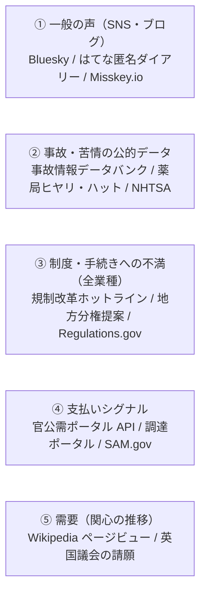

# IT 以外の分野の情報源調査（個人利用）

| 項目 | 内容 |
|---|---|
| 調査日 | 2026-09-29 |
| 前提 | Friction Lens は**自分専用のツール**として使う。商用提供はしない |
| 目的 | 前回の調査で自動収集できる情報源が IT 分野に偏っていたため、**IT 以外の分野**で使える情報源を探す |
| 調査範囲 | 日本の公的データ／日本の民間サービス・データセット／英語圏の公的データ／英語圏の民間サービス・データセット |
| 確認したもの | 公式の API ドキュメント、利用規約の条文、robots.txt。API と一括ファイルはできる限り実際に呼び出して動作と件数を確認した |
| 対象外 | 前回判定済みの情報源（HN、GitHub、Stack Exchange 全体の判定、X、e-Stat、PIO-NET、Google Trends、クラウドワークス、ランサーズ、Yahoo!知恵袋、Reddit、App Store、Google Play、G2／Capterra） |
| 注意 | 規約を読んだ時点での判断であり、法的助言ではない。確認できなかった点は【未確認】と書いた。**どれを使うかはこの資料では決めない** |

関連資料: [前回の調査（情報源の利用可否）](./2026-09-29-data-source-availability.md) / [ADR-0001](../adr/0001-deep-research-and-api-app.md) / [concept.md](../../concept.md)

---

## 1. 結論

- IT 以外の分野でも、個人利用で自動収集できる情報源は多い。判定が ◎／○ のものは 40 以上あり、そのうち有用性が中以上のものは約 20。
- 情報源は大きく 5 タイプに分かれる（下図）。
- **一般消費者のレビュー（EC・飲食・旅行・地図）、Q&A 掲示板、外注案件、YouTube のコメントは、国内外とも自動収集できない。**
- 公的データの多くは、書き手が本人ではなく仲介者（医療機関・自治体・議員・メーカー）で、更新も年 1 回のものが多い。**証拠としての強さと、増加率の計算に使えるかどうかは、情報源ごとに差が大きい。**

---

## 2. 凡例

| 項目 | 値 | 意味 |
|---|---|---|
| 自動収集（個人） | ◎ | 問題なし |
| | ○ | 条件付きで可（条件は詳細を参照） |
| | △ | グレー（推奨しない） |
| | ✕ | 規約上不可、または提供されていない |
| | 手動 | 画面の CSV 出力ボタンやファイルを、手で取り込む |
| 種類 | 摩擦 | 困りごとの本文がある |
| | 支払い | お金を払って解決している証拠（発注・調達・補助金など） |
| | 需要 | 関心の大きさや推移 |
| | 時間コスト | 作業にかかる時間の数値 |
| | 深刻度 | 事故・被害の重さ |
| | 文脈 | 背景情報（規模・制度など） |
| 書き手 | 本人 | 困っている当事者が書いた文章 |
| | 仲介者 | 機関・自治体・議員・メーカーなどが整理・要約した文章 |

---

## 3. 判定一覧

### 3.1 日本の公的データ

| 情報源 | 分野 | 種類 | 書き手 | 自動収集（個人） | 取得方法 | 更新 | 有用性 |
|---|---|---|---|---|---|---|---|
| 消費者庁 事故情報データバンク | 消費生活全般（製品・食品・サービス・住宅・自動車・子ども／高齢者） | 摩擦 | 本人の申出（機関が要約） | 手動 ◎（内部 API の直接取得は △） | 画面から CSV 出力（1 回 1 万件） | 随時 | 高 |
| 規制改革・行政改革ホットライン | 全業種の制度・手続き（建設・福祉・医療・農業・金融・本人確認など） | 摩擦＋省庁の回答 | 本人（個人・企業・団体） | ◎ | 年度別 xlsx | 年数回 | 高 |
| 医療事故情報・ヒヤリハット事例（日本医療機能評価機構） | 医療（病院・診療所） | 摩擦 | 仲介者（医療機関） | ○ | 年別 CSV | 年次 | 高 |
| 薬局ヒヤリ・ハット事例 | 薬局・調剤、医療機関との連携 | 摩擦 | 仲介者（薬局） | ○ | 月別 CSV | 月次 | 高 |
| 官公需情報ポータルサイト 検索 API | 国・独法・自治体の入札（物品・工事・役務。介護・清掃・事務など） | 支払い | 行政 | ◎ | REST API（XML） | 日次 | 中〜高 |
| 地方分権改革 提案募集データベース | 自治体業務・公共サービス（福祉・子育て・農地・建築・選挙事務） | 摩擦 | 仲介者（自治体） | ◎ | xlsx | 年次 | 中〜高 |
| 国会会議録検索システム API | 全分野（介護・建設・物流・農業・医療など） | 摩擦（間接）・文脈 | 仲介者（議員・官僚） | ◎ | REST API（JSON／XML） | 随時 | 中 |
| 職場のあんぜんサイト 労働災害 DB | 建設・物流・製造・小売・社会福祉施設・農林業 | 摩擦・深刻度 | 仲介者 | ◎〜○ | 月別・年別 xlsx | 死傷は停止、死亡は年次 | 中 |
| 国交省 自動車不具合情報 | 自動車・タイヤ・チャイルドシート | 摩擦 | 本人の申告（要約） | 手動 ○（内部 API は △） | 画面から CSV 出力 | 月次 | 中 |
| 農水省 技術的課題（現場ニーズ） | 農業・畜産・食品産業 | 摩擦 | 仲介者（公設試験場・JA など） | ◎ | 年度別 xlsx | 年次 | 中 |
| こども家庭庁 教育・保育施設等の事故 DB | 保育・幼稚園・放課後児童クラブ | 摩擦・深刻度 | 仲介者（施設・自治体） | ◎ | xlsx | 年 1〜2 回 | 中 |
| 調達ポータル 落札実績オープンデータ | 国の調達全般 | 支払い | 行政 | ◎ | CSV／JSON（直接 URL） | 日次差分 | 中 |
| 全国銀行協会 あっせん事案の概要 | 銀行（住宅ローン・団信・窓口販売） | 摩擦 | 仲介者（申立人と銀行の主張の要約） | 手動 ◎（保存・解析は △） | 四半期 PDF | 四半期 | 中 |
| 国民生活センター 相談事例 | 消費生活（賃貸・美容医療・葬儀・引越・定期購入など 30 テーマ） | 摩擦（要約） | 仲介者 | ✕（HTML のみ）／手で読む ◎ | HTML | 随時 | 中 |
| e-Gov パブリック・コメント | 全分野（規制対象の業界） | 摩擦（省庁の要約） | 仲介者（省庁） | ○ | 公式 RSS＋結果 PDF | 日次 | 中〜低 |
| 国立国会図書館 レファレンス協同データベース API | 全分野（市民が調べたいこと） | 需要 | 仲介者（司書） | ○ | API（XML）・RSS | 随時 | 中〜低 |
| 千葉市 ちばレポ オープンデータ | 公共インフラ（道路・公園・ごみ） | 摩擦 | 本人（市民） | ◎ | CSV | 年次 | 低〜中 |
| 金融庁 金融サービス利用者相談室 | 金融（預金・保険・投資・貸金・暗号資産） | 摩擦（FAQ 化） | 仲介者 | 手動 ○ | HTML／PDF、RSS | 四半期 | 低〜中 |
| PMDA JADER（医薬品副作用 DB） | 医薬品 | 深刻度 | 仲介者 | ○ | 同意後に CSV | 月次 | 低 |
| 特許情報取得 API（特許庁） | 全産業の技術 | 文脈 | 出願人 | ○ | API（明細書本文は取れない） | 日次 | 低 |
| e-Gov 法令 API／e-Gov データポータル（CKAN API） | 法令／データセットの検索 | 文脈 | — | ◎ | API | 随時 | 低 |
| 不動産情報ライブラリ API | 不動産（取引価格など） | 文脈 | — | ○（申請制） | API | 随時 | 低 |

### 3.2 日本の民間サービス

| 情報源 | 分野 | 種類 | 書き手 | 自動収集（個人） | 取得方法 | 更新 | 有用性 |
|---|---|---|---|---|---|---|---|
| はてな匿名ダイアリー | 仕事・家庭・育児・お金・人間関係 | 摩擦 | 本人（匿名） | ○ | 公式 RSS（全文） | リアルタイム | 高 |
| Bluesky | 全分野（日常・仕事） | 摩擦 | 本人 | ○ | 検索 API・Jetstream（認証不要） | リアルタイム | 中〜高 |
| Misskey.io | 全分野（趣味・クリエイター寄り） | 摩擦 | 本人 | ○（年 500 件以上は事前連絡） | 公式 API（認証不要） | リアルタイム | 中 |
| はてなブックマーク | 暮らし・学び・世の中・政治経済・IT | 摩擦（短いコメント）＋共感の数 | 本人 | ○ | 公式 RSS、エントリー情報 API | リアルタイム | 中 |
| Mastodon 日本サーバー（mstdn.jp・pawoo など） | 全分野 | 摩擦 | 本人 | ○ | 公開タイムライン API | リアルタイム | 低〜中 |
| note（ハッシュタグ RSS） | 育児・介護・転職・副業の体験記 | 摩擦 | 本人 | △ | 公式 RSS（冒頭の抜粋） | リアルタイム | 中〜高 |
| Threads（keyword_search API） | 全分野 | 摩擦 | 本人 | △（アプリ審査が必要） | 公式 API | リアルタイム | 審査を通れば高 |
| Makuake（RSS） | クラウドファンディングの新着 | 支払い（弱い） | 実行者 | △ | 公式 RSS（支援額なし） | 新着のみ | 低 |

### 3.3 英語圏の公的データ

| 情報源 | 国 | 分野 | 種類 | 書き手 | 自動収集（個人） | 取得方法 | 更新 | 有用性 |
|---|---|---|---|---|---|---|---|---|
| Regulations.gov（コメント） | 米 | 全業種の規制負担（農業・医療・運輸・金融など） | 摩擦 | 本人（事業者・個人） | ◎ | API v4（無料キー） | 随時 | 高 |
| 英国議会 Petitions | 英 | 生活全般（住宅・医療・教育・交通・行政手続） | 摩擦＋需要（署名数） | 本人（市民） | ◎ | JSON（認証不要） | 随時 | 高 |
| NHTSA 車両苦情 | 米 | 自動車・タイヤ・チャイルドシート | 摩擦・深刻度 | 本人 | ◎ | API＋日次の一括 ZIP | 日次 | 高 |
| SAM.gov 調達案件 | 米 | 政府調達（NAICS の業種別） | 支払い（RFI などは課題の記述） | 行政 | ◎ | 一括 CSV（キー不要） | 日次 | 高 |
| openFDA MAUDE | 米 | 医療機器（在宅用を含む） | 摩擦 | 仲介者（主にメーカー） | ◎ | API（キー任意） | 週次 | 中〜高 |
| USAspending | 米 | 政府の支出（業種別） | 支払い | 行政 | ◎ | API（キー不要） | 随時 | 中〜高 |
| CFPB 苦情本文アーカイブ | 米 | 金融（信用情報・債権回収・口座・送金・暗号資産） | 摩擦 | 本人 | ◎ | 一括 ZIP（21 本） | **凍結（〜2026-08-14）** | 中〜高 |
| reginfo.gov PRA 情報収集要求 | 米 | 全業種の事務負担（書式ごと） | 時間コスト | 行政 | ◎ | XML 一括 | 随時 | 中 |
| 英国議会委員会の書面証拠 | 英 | 業界団体・個人の現場の困りごと | 摩擦 | 本人（団体・個人） | ◎ | API（本文は PDF） | 随時 | 中 |
| Hansard／書面質問 | 英 | 全分野（選挙区民の困りごと） | 摩擦（間接） | 仲介者（議員） | ◎ | API | 随時 | 中 |
| Wikimedia ページビュー | 世界（日本語版を含む） | 全分野の関心度 | 需要 | — | ◎ | API（User-Agent 必須） | 日次 | 中 |
| Grants.gov／NIH RePORTER／SBIR | 米 | 研究・補助金（介護・医療など） | 支払い | 行政 | ◎ | API／一括 CSV | 随時 | 中 |
| Find a Tender・Contracts Finder／TED | 英・EU | 政府調達 | 支払い | 行政 | ◎ | OCDS API／TED API | 随時 | 中 |
| EU「Have Your Say」 | EU | 規制への意見（B2B） | 摩擦 | 本人（企業・市民） | △（非公開のバックエンド） | JSON | 随時 | 中 |
| CPSC SaferProducts.gov | 米 | 消費者製品（家電・家具・子ども用品） | 摩擦 | 本人 | ○（キー登録）【本文は未確認】 | OData API | 随時 | 中 |
| FCC ECFS | 米 | 通信規制への意見 | 摩擦 | 本人 | ◎ | API（無料キー） | 随時 | 低〜中 |
| CPSC リコール | 米 | 消費者製品 | 深刻度 | 行政 | ◎ | API | 随時 | 低〜中 |
| openFDA FAERS／CAERS／化粧品 | 米 | 医薬品・食品・化粧品 | 深刻度（本文なし） | 仲介者 | ◎ | API | 四半期など | 低 |
| FCC 消費者苦情 | 米 | 通信（料金・番号ポータビリティなど） | 深刻度（本文なし） | — | ◎ | Socrata API | 日次 | 低 |
| Federal Register／ClinicalTrials.gov／OpenAlex／USPTO／GDELT | 米・世界 | 規則・臨床試験・論文・特許・ニュース | 文脈 | — | ◎〜○ | API | 随時 | 低 |

### 3.4 英語圏の民間サービス・データセット

| 情報源 | 分野 | 種類 | 書き手 | 自動収集（個人） | 取得方法 | 更新 | 有用性 |
|---|---|---|---|---|---|---|---|
| Bluesky（英語） | 全分野（日常・仕事） | 摩擦 | 本人 | ○ | 検索 API・Jetstream | リアルタイム | 高 |
| Stack Exchange 非技術サイト | 住宅・法律・家計・職場・自動車整備・大学・旅行・育児など（4.21 を参照） | 摩擦 | 本人 | ◎（判定済み） | 公式 API | 低頻度 | 中 |
| Steam（appreviews） | ゲーム・PC ソフト | 摩擦 | 本人 | ○ | 公式エンドポイント（キー不要） | リアルタイム | 中（ゲームに偏る） |
| Podcast Index API | ポッドキャスト（全分野） | 摩擦（文字起こし） | 本人 | ○ | API（無料キー） | 随時 | 中 |
| Product Hunt API | 新製品（家族介護・高齢者介護・家計・不動産などのカテゴリもある） | 需要（供給側）・コメント | 本人 | ○（非商用） | GraphQL API | 毎日 | 低〜中 |
| Indiegogo Public API | クラウドファンディング | 支払い（調達額・支援者数） | 実行者 | ○〜△ | API（キー不要） | 随時 | 低〜中 |
| Mastodon／Lemmy | 全分野（技術者寄り） | 摩擦 | 本人 | ○ | API | リアルタイム | 低〜中 |
| Guru | 外注案件 | 支払い | 発注者 | △〜○【未確認】 | API（申請制） | 随時 | 中〜低 |
| Amazon Reviews 2023（UCSD） | EC 全般（家庭用品・ペット・ベビーなど） | 摩擦 | 本人 | △（ライセンスなし） | 一括ダウンロード | 静的（〜2023-09） | 高 |
| MoneySavingExpert フォーラム | 英国の家計・消費者トラブル | 摩擦 | 本人 | △（公式 API ではない。要許可） | — | 毎日 | 高 |
| BBB API | 米国・カナダの企業への苦情 | 摩擦 | 本人 | △ | 承認制・有料 | — | 中 |
| Discourse 製フォーラム | 製品・分野別（銀行・会計・栄養・フィットネスなど） | 摩擦 | 本人 | ✕（標準の規約）〜△ | JSON | 随時 | 中 |

---

## 4. 情報源ごとの詳細（有用性が中以上のもの）

### 4.1 消費者庁 事故情報データバンク

| 観点 | 内容 |
|---|---|
| 分野 | 消費生活全般。製品、食品、サービス、住宅（建築物の事故）、自動車、子ども・高齢者、中毒 |
| 収録元 | PIO-NET の危害・危険相談、法テラス、国交省の自動車不具合ホットライン、国総研の建築物事故ホットライン、NITE、日本中毒情報センターなど |
| 取得方法 | 公開 API はない。画面の「CSV 出力」ボタンから 1 回 1 万件まで取り出せる |
| 規約 | 「公共データ利用規約（第1.0版）」に準拠。出典の記載例は「出典：消費者庁「事故情報データバンク」（URL）（〇年〇月〇日に検索）」 |
| 注意 | 事実確認（因果関係の精査）を経ていない情報を含む。同じ事故が複数の機関から重複して登録されている。対象は生命・身体に関わる事故で、金銭トラブルは含まない。2026-09-14 にシステムが更改された。CSV の実際のダウンロードは未実行 |

### 4.2 規制改革・行政改革ホットライン

| 観点 | 内容 |
|---|---|
| 分野 | 全業種の制度・手続き（建設、福祉・生活保護、医療、農業、金融、本人確認など） |
| 取得方法 | 年度別の xlsx（令和 2〜6 年度の提案一覧と回答）。令和 6 年度の回答は約 480 行、令和 5 年度は約 626 行 |
| 規約 | 行革事務局の利用規約で「公共データ利用規約（第1.0版）」に準拠。ただし提案本文は提案者の著作物の可能性があるので、原文の引用は限定的にする |
| 本文例 | 「『免許証番号を控えさせていただきますね。』…『その労力、IC カードリーダーの購入費用より高くないですか？』」 |
| 注意 | xlsx の共有文字列にふりがなが入っているので、読み込むときに除く。提案者として企業・団体名が載ることがある |

### 4.3 医療事故情報・ヒヤリハット事例（日本医療機能評価機構）

| 観点 | 内容 |
|---|---|
| 分野 | 医療（病院・診療所） |
| 取得方法 | 年別 CSV（2010〜2025 年、cp932）。2025 年分は医療事故 6,118 件、ヒヤリハット 9,994 件 |
| 規約 | 「個人の私的使用、その他著作権法によって認められる範囲を超えて…使用…することは、事前に当機構から許可を得た場合を除いて禁止」。営利目的の行為も禁止 → **私的使用と情報解析の範囲に限り ○。再配布・公開は不可** |
| 本文例 | 「退院時に発行された診療情報提供書にのみ…アレルギーの記載があった」（情報連携・転記の摩擦） |
| 注意 | 報告者は医療機関で、患者の声ではない |

### 4.4 薬局ヒヤリ・ハット事例

| 観点 | 内容 |
|---|---|
| 分野 | 薬局・調剤、医療機関との連携 |
| 取得方法 | 月別 CSV（2020-03〜2026-08 の 78 か月分）。2026 年 7 月分は 8,427 件 |
| 規約 | 4.3 と同じ機構の規約（○） |
| 本文例 | 「医療機関側は残薬の情報を確認していない」 |
| 注意 | 月次で更新されるので、IT 以外の分野では数少ない、増加率を計算できる情報源 |

### 4.5 官公需情報ポータルサイト 検索 API（中小企業庁）

| 観点 | 内容 |
|---|---|
| 分野 | 国・独法・自治体の入札（物品・工事・役務） |
| 取得方法 | REST API（XML）。認証なし・無料。1 回 1,000 件まで。「介護 AND 委託」で 7,940 件、直近 30 日の「業務」で 4,521 件 |
| 規約 | 「本APIを利用するサイトやアプリケーションには、当ポータルサイトのAPIを用いている旨を明記…リンクを設ける」「特定のサーバーから継続して大量のアクセスは禁止」 |
| 注意 | ランサーズ・クラウドワークスに代わる支払いシグナルになる。ただし発注者は行政（B2G）に限られる |

### 4.6 地方分権改革 提案募集データベース（内閣府）

| 観点 | 内容 |
|---|---|
| 分野 | 自治体業務・公共サービス（福祉、子育て、農地、建築、選挙事務など） |
| 取得方法 | xlsx の一括ダウンロード（平成 26 年〜令和 7 年、約 4,250 行） |
| 規約 | 内閣府ホームページ利用規約で「公共データ利用規約（第1.0版）」が適用される |
| 本文例 | 「供託金を納める手続きにも移動が困難であったり、事務手続きを職員が肩代わりしたりしている」 |
| 注意 | 書き手は自治体で、住民本人の声ではない |

### 4.7 国会会議録検索システム API

| 観点 | 内容 |
|---|---|
| 分野 | 全分野 |
| 取得方法 | REST API（JSON／XML）。認証なし・無料。発言は 1 回 100 件まで。2026 年 1〜9 月の発言は 76,001 件 |
| 規約 | 「私的使用のための複製、引用…電子計算機による情報解析等」は「著作権者の許諾を得ることなくご利用いただけます」。多重リクエストは避け、数秒あけて次のリクエストを送る |
| 本文例 | 「建築士の方の人手不足というのがすごく深刻化…家族の介護を理由に離職も増えています」 |
| 注意 | 議員・官僚の言葉で、当事者の声ではない。党派性がある |

### 4.8 職場のあんぜんサイト 労働災害 DB（厚労省）

| 観点 | 内容 |
|---|---|
| 分野 | 建設、物流・運輸、製造、小売・飲食、社会福祉施設、農林業 |
| 取得方法 | 月別・年別の xlsx。死傷 DB は平成 18〜令和 3 年（休業 4 日以上の約 1/4 を無作為抽出）。死亡 DB は平成 3〜令和 6 年の全数 |
| 規約 | サイト固有の規約は見つからなかった。厚労省サイトと同じ「公共データ利用規約（第1.0版）」と推定【未確認】 |
| 注意 | **死傷 DB は令和 3 年で更新が止まっている**ので、増加率の計算には使えない |

### 4.9 国交省 自動車不具合情報

| 観点 | 内容 |
|---|---|
| 分野 | 自動車・タイヤ・チャイルドシート |
| 取得方法 | 検索画面から CSV 出力。令和 7 年度は受付 4,816 件のうち有効 2,952 件 |
| 規約 | 国交省サイトは「公共データ利用規約（第1.0版）」に準拠 |
| 注意 | 「商品性や金銭に関わる問い合わせは受付対象外」なので、安全・故障の話に偏る |

### 4.10 はてな匿名ダイアリー

| 観点 | 内容 |
|---|---|
| 分野 | 仕事・家庭・育児・お金・人間関係 |
| 取得方法 | `https://anond.hatelabo.jp/rss`（認証不要）。最新 25 件の全文。夕方の時点で約 13 分ぶん → 5〜10 分ごとに取得する |
| 規約 | はてな利用規約（2023-07-01 改定）第 8 条 4 に、投稿の配布形態として「APIやRSSフィードとしての公開、配信」と明記。第 6 条で他人の個人情報の収集・蓄積を禁止 |
| 本文例 | 「管理職は完了したかしか見ないから穴を残せ」（職場の摩擦） |
| 注意 | 匿名なので**ユニークユーザー数は数えられない**。robots.txt で AI クローラー（GPTBot・ClaudeBot など）を拒否しているので、LLM は学習に使われない・データを保持しない設定の API で使い、原文は再公開しない |

### 4.11 Bluesky

| 観点 | 内容 |
|---|---|
| 分野 | 全分野（日常・仕事） |
| 取得方法 | 検索 API `api.bsky.app/xrpc/app.bsky.feed.searchPosts`（認証なしで 200、`lang=ja` で日本語に絞れる）と、リアルタイム配信の Jetstream（認証不要）。無料 |
| 規模 | Jetstream を 60 秒受信すると 1,829 投稿、うち日本語は 375 件（夕方のピーク時）。英語で直近 30 日の検索ヒット数は「landlord」6,583、「spreadsheet」4,870、「so frustrating」3,737 |
| 規約 | ToS（2025-08-14）に収集・保存・解析を禁じる条項はない。開発者ガイドライン：「All services must have a method for deleting content a user has requested to be deleted.」 |
| 条件（○） | 元の投稿が削除されたら手元のデータも消す（Jetstream の削除イベントを使う） |
| 注意 | 認証なしの検索が今後も使える保証はない（キャッシュ付きの `public.api.bsky.app` は 403 だった）。利用者は米国のリベラル層やクリエイターに偏っている |

### 4.12 Misskey.io

| 観点 | 内容 |
|---|---|
| 分野 | 全分野（趣味・クリエイター寄り） |
| 取得方法 | 公式 API（`/api/notes/search`、`/api/notes/local-timeline`。認証不要）。ローカルユーザー 744,538 人、ノート 1.78 億件 |
| 規約（2026-05-12 版） | 禁止事項に「個人利用の範疇を超えるデータ収集 ※年間500件以上のデータ収集を行う場合、予め legal@misskey.io へご連絡ください」 |
| 条件（○） | **事前に legal@misskey.io へ連絡する**。削除に追従する |

### 4.13 はてなブックマーク

| 観点 | 内容 |
|---|---|
| 分野 | 暮らし・学び・世の中・政治経済・IT |
| 取得方法 | 本文検索 RSS、カテゴリ別 RSS（`/hotentry/life.rss` など）、エントリー情報 API（`/entry/json/`、認証不要） |
| 規約 | Hatena Developer Center 規約 第 2 条で「目的の範囲内で無償かつ非独占的に使用できます」。第 4 条で商用目的、第三者への開示・提供、サーバーへの過剰な負荷を禁止 |
| 注意 | コメントは短い反応が中心。ブックマーク数は「共感の強さ」の指標になる。robots.txt の `Crawl-delay: 5` に合わせて間隔をあける |

### 4.14 Regulations.gov（コメント API）

| 観点 | 内容 |
|---|---|
| 分野 | 米国の全業種の規制負担（農業・医療・運輸・金融など） |
| 取得方法 | `api.regulations.gov/v4/comments`。キーは api.data.gov で無料発行。2026-09 だけで 496,817 件、直近 7 日で 79,500 件 |
| 規約 | API の利用条件は主に投稿（POST）向けで、取得に固有の制限はない。コメント本文は投稿者の著作物 |
| 本文例 | 「Delegated entities portal vs CSVs/spreadsheets vs FHIR APIs usage…」（医療分野でのスプレッドシート依存） |
| 注意 | 同じ文面を大量に送るキャンペーンが多く、**重複の除去が必須**。本文が添付 PDF にあることが多い。投稿者の氏名が含まれる |

### 4.15 英国議会 Petitions

| 観点 | 内容 |
|---|---|
| 分野 | 英国の生活全般（住宅・医療・教育・交通・行政手続） |
| 取得方法 | `petition.parliament.uk/petitions.json`（認証不要）。現議会期は 16,261 件（却下分を含む）、アーカイブは約 52,031 件 |
| 規約 | 「Open Government Licence v3.0」 |
| 注意 | 署名数は取得時点の値なので、定期的に取得して推移を作る。レート制限は公開されていない |

### 4.16 NHTSA 車両苦情

| 観点 | 内容 |
|---|---|
| 分野 | 米国の自動車・タイヤ・チャイルドシート |
| 取得方法 | API（車種の指定が必須）と、日次で更新される一括 ZIP（`static.nhtsa.gov/odi/ffdd/cmpl/`）。固有の苦情は月 5,262〜7,266 件 |
| 規約 | 規約ページは bot を 403 で拒否し、取得できなかった【未確認】。連邦政府のデータで、一般にはパブリックドメイン |
| 本文例 | 「Dealership offered to repair at cost to me.」（修理費を自己負担させられる摩擦） |
| 注意 | 1 件の苦情が部品ごとに複数行になるので、苦情番号で重複を除く |

### 4.17 openFDA MAUDE（医療機器の有害事象）

| 観点 | 内容 |
|---|---|
| 分野 | 米国の医療機器（血糖測定器・インスリンポンプなどの在宅用を含む） |
| 取得方法 | `api.fda.gov/device/event.json`。キーなしで 1,000 回/日、キーありで 120,000 回/日。累計 26,136,889 件、2025 年受付 2,888,003 件 |
| 規約 | 「public domain … CC0 1.0 Universal」 |
| 注意 | 本文の大半はメーカーが要約したもので、利用者の声そのものではない |

### 4.18 CFPB 苦情本文アーカイブ

| 観点 | 内容 |
|---|---|
| 分野 | 米国の金融（信用情報・債権回収・口座・送金・暗号資産） |
| 取得方法 | FOIA Reading Room の一括 ZIP 21 本（2011-12〜2026-08-14、本文約 380 万件）。API で取れるのは件数とカテゴリだけ |
| 規約 | CC0 |
| 注意 | **2026-08-14 に本文の公開が停止された**ので、本文の増加は追えない（カテゴリ別の件数は API で日次に追える）。業者によるテンプレート文が多く、除く処理が必須。アーカイブの取得は、調査担当の間で成功と 403 に結果が分かれた【要確認】 |

### 4.19 SAM.gov 調達案件／USAspending

| 観点 | 内容 |
|---|---|
| 分野 | 米国政府の調達・支出（NAICS の業種別） |
| 取得方法 | SAM.gov は一括 CSV（232MB、キー不要、日次）。USAspending は API（キー不要） |
| 使い道 | RFI や Sources Sought は、政府が課題を文章で書いたもの。USAspending では、たとえば「data entry」で FY2026 の契約が 4,357 件あり、手作業の外注市場の規模がわかる |
| 注意 | SAM.gov の API は個人だと 10 回/日なので、CSV を使う |

### 4.20 reginfo.gov PRA 情報収集要求

| 観点 | 内容 |
|---|---|
| 分野 | 米国の全業種の事務負担（連邦の書式ごと） |
| 取得方法 | XML の一括ファイル（約 100MB）。有効な情報収集要求は 10,256 件 |
| 項目 | 事務負担の時間、回答数、対象（民間・個人）、頻度、電子提出できるかどうか |
| 使い道 | 「どの業種が、どの書式に年に何時間使っているか」という**時間コストの数値的な裏付け** |

### 4.21 Stack Exchange 非技術サイト

2026-09-29 に API で取得した値。Stack Exchange 全体は前回の調査で ◎ と判定済み。

| サイト | 分野 | 総質問数 | 直近 30 日の新規質問 | 摩擦データとしての価値 |
|---|---|---|---|---|
| Home Improvement（diy） | 住宅・DIY | 93,471 | 91 | 高 |
| Law（law） | 法律 | 32,110 | 70 | 高 |
| Motor Vehicle Maintenance（mechanics） | 自動車整備 | 28,517 | 21 | 高 |
| Personal Finance & Money（money） | 家計・税 | 40,244 | 14 | 高 |
| The Workplace（workplace） | 職場 | 32,955 | 13 | 高 |
| Academia（academia） | 大学・研究者 | 46,758 | 32 | 中〜高 |
| Bicycles（bicycles） | 自転車 | 22,232 | 39 | 中 |
| Travel（travel） | 旅行 | 51,307 | 16 | 中 |
| Gardening（gardening） | 園芸 | 18,757 | 9 | 中 |
| Medical Sciences | 医療 | 8,028 | 7 | 中 |
| Pets／Parenting | ペット・育児 | 8,582／7,055 | 3／2 | 中（過去分） |
| Freelancing／Expatriates／Interpersonal Skills | 個人事業・海外生活・対人関係 | 2,053／8,201／3,956 | 1／1／1 | 中（過去分） |
| Seasoned Advice（cooking） | 料理 | 28,187 | 15 | 低〜中 |

注意：**過去の蓄積は厚いが、新しい質問は少ない。** 7/30 日の増加率の計算には向かず、過去の原文や基準値として使う。

### 4.22 Steam（appreviews）

| 観点 | 内容 |
|---|---|
| 分野 | PC ゲーム・ソフト（日本語を含む多言語） |
| 取得方法 | `store.steampowered.com/appreviews/<appid>?json=1`（キー不要）。`review_type=negative` で否定的なレビューだけに絞れる |
| 規約 | Web API の規約は 100,000 回/日。保存期間の制限や解析の禁止は見当たらない |
| 注意 | ゲームに偏る。投稿者の ID と名前は保存しない |

---

## 5. 分野別の早見表

| 分野 | 日本語の情報源 | 英語の情報源 |
|---|---|---|
| 生活・消費 | 事故情報データバンク、はてな匿名ダイアリー、Bluesky | Bluesky、英国議会の請願、CPSC SaferProducts |
| 仕事・職場 | はてな匿名ダイアリー、Bluesky、規制改革ホットライン | Bluesky、Stack Exchange（Workplace） |
| 医療・介護 | 医療事故・ヒヤリハット、薬局ヒヤリ・ハット、国会会議録 | openFDA MAUDE、NIH RePORTER、Stack Exchange（Medical Sciences） |
| 金融・家計 | はてな匿名ダイアリー、全銀協あっせん事案（手動）、金融庁相談事例（手動） | CFPB 本文アーカイブ、Stack Exchange（Money） |
| 自動車・移動 | 自動車不具合情報（手動）、事故情報データバンク | NHTSA、Stack Exchange（Mechanics） |
| 住宅・不動産 | 事故情報データバンク（建築物の事故を含む） | Stack Exchange（DIY） |
| 行政・制度（全業種の B2B） | 規制改革ホットライン、地方分権提案、パブリックコメント、国会会議録 | Regulations.gov、reginfo.gov、英国議会委員会の書面証拠、Hansard |
| 農業・食品 | 農水省 現場ニーズ | Regulations.gov（農務省の案件） |
| 建設・物流・製造 | 労働災害 DB、規制改革ホットライン | Regulations.gov |
| 保育・教育 | 保育施設の事故 DB | Stack Exchange（Academia・Parenting） |
| 公共インフラ | ちばレポ | — |
| ゲーム・ソフト | — | Steam |
| 支払いシグナル（全業種） | 官公需ポータル API、調達ポータル | SAM.gov、USAspending、Grants.gov、Find a Tender・TED |
| 需要（全分野） | Wikipedia ページビュー（日本語版）、レファレンス協同 DB | Wikipedia ページビュー、英国議会の請願（署名数） |

---

## 6. 使えないとわかった情報源

| 情報源 | 分野 | 理由 |
|---|---|---|
| **YouTube のコメント** | 全分野 | Developer Policies（2026-09-14）で、保存は 30 日まで、「must not … access or use API Data to create new or derived data or metrics」、集計の禁止。Friction Lens の構造化・件数集計に当たる（規約の原文で確認済み） |
| 楽天ウェブサービス | EC・旅行・ゴルフ | 規約 第 10 条(10)「特定の人のみがアクセスできる環境でウェブサービスを使用すること」を禁止（自分専用ツールが該当）。レビュー本文もほぼ取れない |
| Yahoo!ショッピング 商品レビュー検索 API | EC | 2021-09-30 に提供終了 |
| じゃらん／ホットペッパー／食べログ／価格.com | 旅行・飲食・家電 | レビュー API がない。じゃらんは新規受付を停止。食べログは口コミの無断利用を禁止 |
| Google Places API | 地域の店舗 | 口コミの保存を禁止（Google Maps Platform 規約 3.2.3） |
| Yelp／Tripadvisor／Trustpilot／Etsy／Best Buy／Walmart／Amazon／Goodreads | 店舗・旅行・EC・本 | 保存の禁止、AI・分析への利用禁止、または API の終了 |
| 教えて!goo | 生活 Q&A | 2025-09-17 にサービス終了 |
| OKWAVE／発言小町／ガールズちゃんねる／ママスタ／5ch | 生活 Q&A・掲示板 | API がない、または自動収集を明示的に禁止 |
| Quora／Mumsnet／Nextdoor／BiggerPockets／Tripadvisor フォーラム | Q&A・地域・不動産・旅行 | 自動収集を禁止、または API が非公開 |
| Freelancer.com／Upwork／PeoplePerHour／Fiverr | 外注案件 | 保存は 24 時間まで、書面許可が必要、または API がない |
| CAMPFIRE／READYFOR／ココナラ／Kickstarter／Patreon | クラウドファンディング・スキル販売 | API がない、またはスクレイピングを禁止 |
| ハローワーク求人情報提供 API／Indeed／求人ボックス | 求人 | 対象が職業紹介事業者と自治体に限られる、または個人向けの API がない |
| NII IDR の企業提供データ（楽天・リクルート・クックパッド・弁護士ドットコムなど） | 各種レビュー・Q&A | 大学・公的研究機関の研究者に限られる。個人は申請できない |
| NII IDR の Yahoo!知恵袋データ／不満調査データセット | Q&A・不満 | 2025 年に提供終了 |
| Yelp Open Dataset | 飲食 | 利用できるのは非営利団体・政府・教育機関だけ |
| Amazon 多言語レビュー（MARC） | EC | 配布終了 |
| Tumblr／Facebook Groups／TikTok／Discord | SNS | 保存は 3 日まで、API の廃止、研究機関に限定、など |
| 英国 FOS（金融オンブズマン）の決定 | 金融 | 電子的な保存を禁止 |
| J-PlatPat | 特許 | 「ロボットアクセス…のような行為は禁止」 |
| NewsAPI（無料枠）／Guardian／NYT／Listen Notes | ニュース・ポッドキャスト | 開発・試験用に限る、AI 利用の禁止、保存の禁止 |

---

## 7. 横断的な論点

### 7.1 情報源の性質の違い

| 観点 | 内容 | 対応 |
|---|---|---|
| 書き手 | 公的データの多くは仲介者（医療機関・自治体・議員・メーカー）が書いた文章で、本人の声より証拠としては弱い | Friction Event に「書き手（本人／仲介者）」の項目を足して区別する |
| 更新頻度 | 年 1 回の更新や、更新が止まったものは、7/30/90 日の増加率に使えない | 過去の蓄積（基準値）として扱う |
| 定型文 | Regulations.gov のキャンペーン投稿や、CFPB の業者のテンプレート文が大量にある | 重複を除き、1 人 1 件に数え直す |
| 匿名 | はてな匿名ダイアリーには投稿者の識別子がない | ユニークユーザー数は「なし」と表示する |
| 国 | 英語圏の公的データは、制度・商品・企業名が米英に固有 | 摩擦の「型」を取り出し、日本で確かめる材料として使う |

### 7.2 規約・取得方法

- **府省のサイトの多くは「公共データ利用規約（第1.0版）」（PDL1.0、令和 6 年 7 月 5 日にデジタル庁が制定、CC BY 4.0 互換）に移行している。** 出典（URL・利用日）の記載が必要で、加工した場合はその旨も明記する。調達ポータルは「政府標準利用規約（第2.0版）」のまま。
- **市民や事業者が書いた本文**（パブリックコメントの意見、ホットラインの提案など）は、国の著作物ではなく書き手の著作物の可能性がある。個人の分析は著作権法 30 条・30 条の 4 の範囲で問題になりにくいが、画面に原文を出すときは引用（32 条）の範囲にとどめる。
- **公式に配布されている CSV／xlsx の直接ダウンロードは、「公式の一括データ」として扱える**（URL が規則的なので HTML の解析は不要）。一方、画面の CSV 出力ボタンしかないもの（事故情報データバンク・自動車不具合情報）は手動で取り込み、画面の内部 API は直接呼ばない。
- **削除への追従**が必要な情報源：Bluesky、Misskey.io、Mastodon。
- **事前連絡**が必要な情報源：Misskey.io（年 500 件以上）。国立国会図書館のレファレンス協同データベースも、継続して使う場合は連絡を求めている。
- **私的使用に限られる**情報源：医療事故情報・薬局ヒヤリ・ハット（再配布・公開は不可）。

### 7.3 2025〜2026 年の主な変化

| 時期 | 変化 |
|---|---|
| 2025-03-24 | RESAS API が提供終了 |
| 2025 年 | NII IDR の Yahoo!知恵袋データと不満調査データセットが提供終了 |
| 2025-09-17 | 教えて!goo がサービス終了 |
| 2026-03-20 | PatentsView が USPTO Open Data Portal に移行（キーが必要） |
| 2026-08-14 | CFPB が苦情本文の公開を停止 |
| 2026 年 | OpenAlex が従量課金に移行 |
| 2026 年 | SBIR.gov API がメンテナンス中で停止（一括 CSV は取得可能） |

---

## 8. 未確認事項

- CPSC SaferProducts.gov の本文の有無と件数（API キーを登録していない）
- 事故情報データバンクの総件数と、CSV の実際のダウンロード
- 労働災害 DB のサイト固有の規約（PDL1.0 と推定）
- 全国銀行協会のサイトポリシー（URL が 404）
- 行政事業レビュー見える化サイト（RS システム）の CSV と規約
- 特許の一括ダウンロードサービスの規約（個人が申し込めるか）
- CFPB 本文アーカイブを日本から取得できるか（結果が分かれた）
- Regulations.gov のレート制限の具体的な値（1,000 回/時とする資料と、50 回/分・500 回/時とする資料がある）
- NHTSA の規約本文
- Bluesky の日本の利用者数、利用者が AI 利用の可否を示す「User Intents」が実装されたか
- Threads のアプリ審査の要件（ビジネス認証が必要か）
- note の規約全文
- Misskey.io のレート制限の具体的な値
- Steam 利用規約の「Automation」条項の適用範囲
- Guru の API 規約
- Amazon Reviews 2023 の利用条件（ライセンスが付いていない）

---

## 9. 出典

**日本の公的データ**
- 公共データ利用規約（第1.0版）: https://www.digital.go.jp/resources/open_data/public_data_license_v1.0
- 事故情報データバンク: https://www.jikojoho.caa.go.jp/ai-national/
- 規制改革・行政改革ホットライン: https://www.gyoukaku.go.jp/hotline/index.html
- 行革事務局 利用規約: https://www.gyoukaku.go.jp/riyoukiyaku/riyoukiyaku.html
- 医療事故情報収集等事業: https://www.med-safe.jp/contents/report/report.html
- 薬局ヒヤリ・ハット事例収集・分析事業: https://www.yakkyoku-hiyari.jcqhc.or.jp/contents/report/report.html
- 日本医療機能評価機構 利用規約: https://jcqhc.or.jp/terms_and_conditions
- 官公需情報ポータルサイト API: https://www.kkj.go.jp/api/
- 地方分権改革 提案募集データベース: https://www.cao.go.jp/bunken-suishin/teianbosyu/database.html
- 内閣府 利用規約: https://www.cao.go.jp/notice/rule.html
- 国会会議録検索システム API: https://kokkai.ndl.go.jp/api.html
- 職場のあんぜんサイト 労働災害 DB: https://anzeninfo.mhlw.go.jp/anzen_pgm/SHISYO_FND.html
- 自動車不具合情報: https://renrakuda.mlit.go.jp/renrakuda/opn.html
- 農林水産省 技術的課題（現場ニーズ）: https://www.maff.go.jp/j/kanbo/kihyo03/gityo/g_needs/index.html
- こども家庭庁 事故情報データベース: https://www.cfa.go.jp/policies/child-safety/effort/database/
- 調達ポータル: https://www.p-portal.go.jp/pps-web-biz/UAB02/OAB0201
- e-Gov パブリック・コメント RSS: https://public-comment.e-gov.go.jp/rss/pcm_result.xml
- レファレンス協同データベース API: https://crd.ndl.go.jp/jp/help/general/api.html
- ちばレポ オープンデータ: https://www.city.chiba.jp/sogoseisaku/shichokoshitsu/kohokocho/chibarepo_opendata.html
- 国民生活センター 著作権: https://www.kokusen.go.jp/info/data/copyright.html
- 金融サービス利用者相談室: https://www.fsa.go.jp/receipt/soudansitu/index.html
- 全国銀行協会 あっせん事案: https://www.zenginkyo.or.jp/adr/conditions/year/
- PMDA JADER: https://www.pmda.go.jp/safety/info-services/drugs/adr-info/suspected-adr/0003.html
- 特許情報取得 API: https://www.jpo.go.jp/system/laws/sesaku/data/api-provision.html
- J-PlatPat 注意事項: https://www.inpit.go.jp/j-platpat_info/guide/j-platpat_notice.html
- ハローワーク求人情報提供: https://www.hellowork.mhlw.go.jp/provide/provide_top.html

**日本の民間サービス・データセット**
- はてな利用規約: https://www.hatena.ne.jp/rule/rule
- はてな匿名ダイアリー RSS: https://anond.hatelabo.jp/rss
- Hatena Developer Center 規約: https://developer.hatena.ne.jp/license
- はてなブックマーク エントリー情報 API: https://developer.hatena.ne.jp/ja/documents/bookmark/apis/getinfo
- Bluesky 開発者ガイドライン: https://bsky.network/docs/developer-guidelines
- Bluesky 利用規約: https://bsky.social/about/support/tos
- Bluesky Jetstream: https://bsky.network/docs/jetstream
- Misskey.io 利用規約: https://go.misskey.io/tos
- Threads keyword search: https://developers.facebook.com/docs/threads/keyword-search
- 楽天ウェブサービス 規約: https://webservice.rakuten.co.jp/guide/rule
- Yahoo!ショッピング 商品レビュー検索 API 終了: https://developer.yahoo.co.jp/changelog/2021-07-29-shopping265.html
- 食べログ 利用規約: https://tabelog.com/help/rules/
- Google Maps Platform 規約: https://cloud.google.com/maps-platform/terms
- OKWAVE 利用規約: https://okweb.co.jp/about/policy/
- NII IDR データ一覧: https://www.nii.ac.jp/dsc/idr/datalist.html
- NII IDR 利用規約（個人利用者用）: https://www.nii.ac.jp/dsc/idr/service/documents/service-policy-indv.html

**英語圏の公的データ**
- Regulations.gov API: https://open.gsa.gov/api/regulationsgov/
- api.data.gov: https://api.data.gov/docs/developer-manual/
- 英国議会 Petitions: https://petition.parliament.uk/help
- NHTSA 苦情データ: https://static.nhtsa.gov/odi/ffdd/cmpl/
- openFDA 認証・レート制限: https://open.fda.gov/apis/authentication/
- openFDA ライセンス: https://open.fda.gov/license/
- CFPB 本文公開停止の発表: https://www.consumerfinance.gov/about-us/newsroom/the-cfpb-to-cease-discretionary-publication-of-complaint-narratives-and-visualizations/
- CFPB 本文アーカイブ: https://www.consumerfinance.gov/foia-requests/foia-electronic-reading-room/cfpb-consumer-complaint-database-narratives-archive/
- SAM.gov 案件 API: https://open.gsa.gov/api/get-opportunities-public-api/
- reginfo.gov PRA XML: https://www.reginfo.gov/public/do/PRAXML
- 英国議会委員会 API: https://committees-api.parliament.uk/
- Wikimedia API アクセス方針: https://doc.wikimedia.org/generated-data-platform/aqs/analytics-api/documentation/access-policy.html
- SaferProducts.gov FAQ: https://www.saferproducts.gov/FAQs/FrequentlyAskedQuestions11
- SBIR API: https://www.sbir.gov/api
- PatentsView の移行: https://www.uspto.gov/subscription-center/2026/patentsview-migrating-uspto-open-data-portal-march-20
- OpenAlex 料金: https://help.openalex.org/access/pricing/
- GDELT: https://www.gdeltproject.org/about.html
- 英国 FOS 法的方針: https://www.financial-ombudsman.org.uk/legal-policy

**英語圏の民間サービス・データセット**
- YouTube Developer Policies: https://developers.google.com/youtube/terms/developer-policies
- Stack Overflow Acceptable Use Policy: https://stackoverflow.com/legal/acceptable-use-policy
- Steam レビュー取得: https://partner.steamgames.com/doc/store/getreviews
- Mastodon レート制限: https://docs.joinmastodon.org/api/rate-limits/
- Bluesky User Intents 提案: https://github.com/bluesky-social/proposals/tree/main/0008-user-intents
